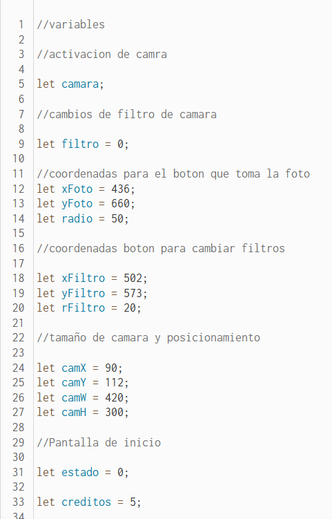
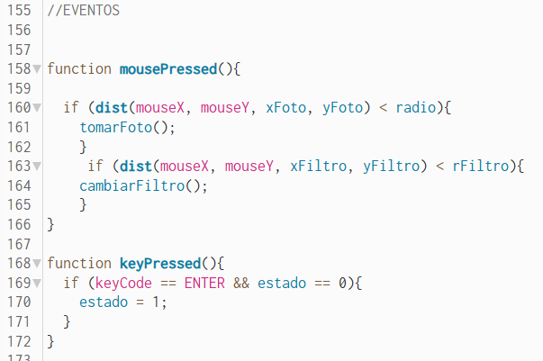
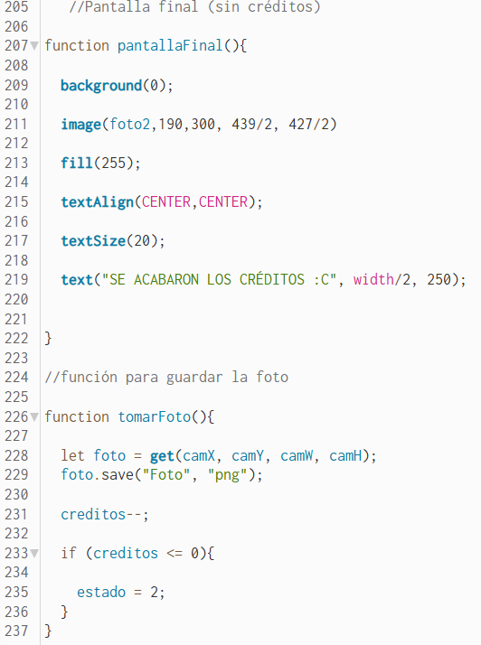
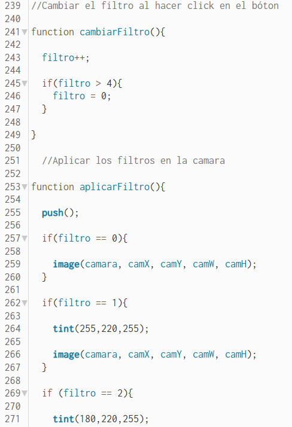
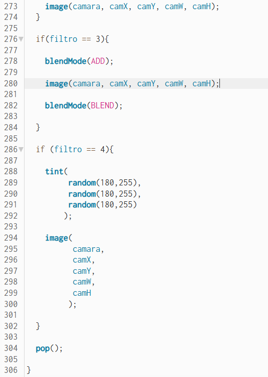
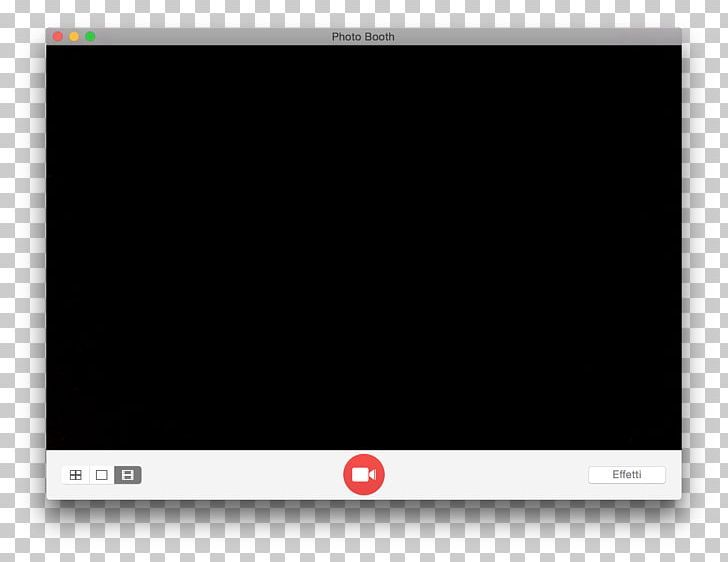
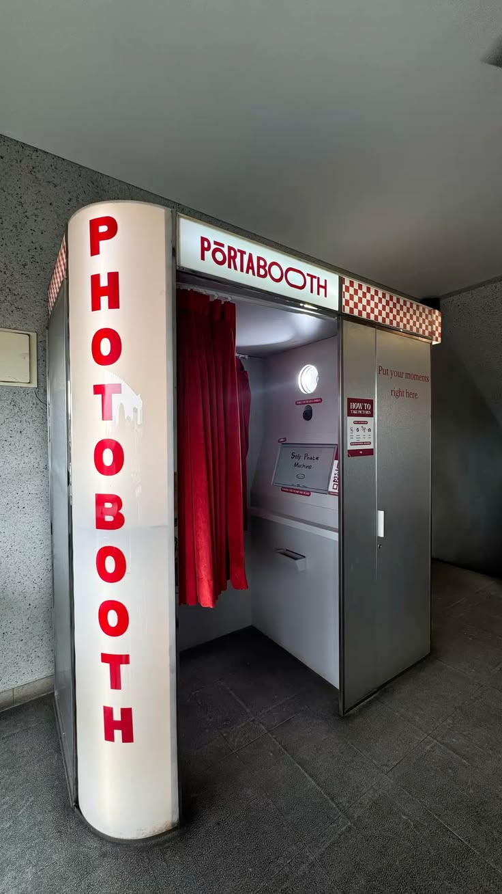
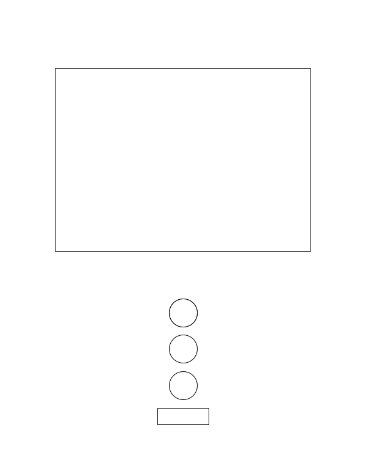
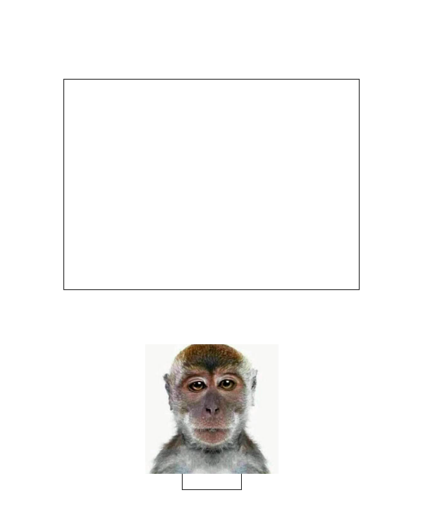
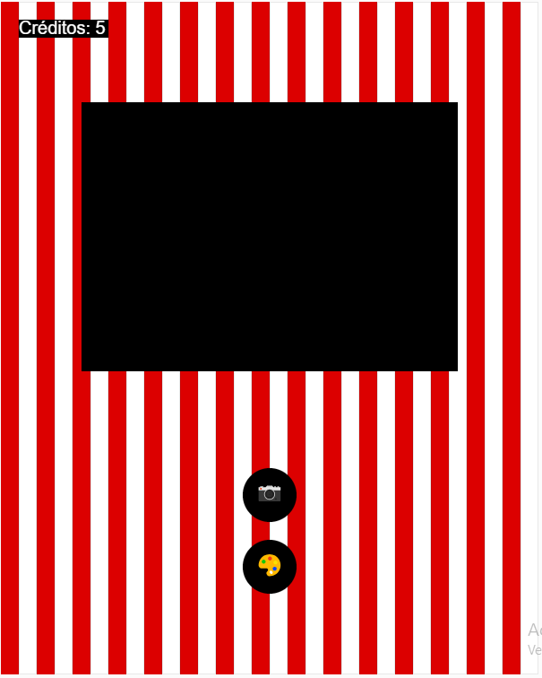

# EXAMEN PENSAMIENTO COMPUTACIONAL

## Nombre proyecto: PHOTO BOOTH

**Autor: Matías Padilla**

[Link público](https://editor.p5js.org/INVISIBLE/full/E_CAP5oH5)
[Link editable](https://editor.p5js.org/INVISIBLE/sketches/E_CAP5oH5)

**Descripción General:**

En terminos generales la intención del código es generar una cabina fotográfica interactiva con el usuario.

**Descripción Objetiva:**

El proyecto consta en programar una camara fotografica funcional, esta consta con 3 etapas, siendo la primera
la presentación de la cabina fotografica, la segunda es la parte interactiva y la tercera etapa es aquella
que avisa del termino de los créditos para tomar fotos (pantalla final), los elementos visuales que se aprecian
en el codigo es la pantalla principal, la cual proyecta la camara, algunos elementos decorativos y dos botones
funcionales, uno siendo el disparador (el cual guarda la foto automaticamente en el dispositivo) y el cambio
de filtro.

**¿Qué inputs y outputs tiene el código?**

El código genera una interacción con el mouse y el teclado, siendo estos los botones de foto y filtro, y la parte
del inicio que usa la tecla ENTER para proceder a usar la cabina fotográfica.

**Descripción conceptual:**

Como referente de diseño utilicé las cabinas fotograficas que se utilizan en centros comerciales, y en cuanto a lo
visual utilicé a BMO de hora de aventura, ya que se me hace una interfaz agradable y representa un personaje cartoon
bastante querido por el público. El principio de diseño utilizado fue el diseño de interfaces, ya que básicamente
eso es todo el código.

**Sistema computacional:**

Inputs:

//Eventos

mousePressed();

El uso que le di al input de **mousePressed()** fue para poder hacer funcionar los botones, este funcionaba en
conjunto a **dist()** el cual calcula a través del mouse distancias entre elementos.  

keyPressed();

El comando **keyPressed()** se utilizó más que nada para dar inicio a la parte interactiva del código.

**Outputs:**

Los outputs que logran en el código son los de generar cambios en el filtro de la camara, la toma de fotos y el guardado
automático de las fotos en el dispositivo, también está el contador de créditos, el cual va cambiando a medida que se va
presionando el boton de disparo.

**Estados:**

El código consta de 3 estados:

- 1: Pantalla de inicio/presentación.
- 2: Zona interactiva.
- 3: Pantalla final (se acabaron los créditos).

**Explicación de la interacción:**

Los datos que van entrando al sistema son los siguientes: 

A partir de estas variables se definen 7 interacciones:

- 1: Activación de camara.
- 2: Filtros.
- 3 y 4: Coordenadas que definen el tamaño y la posición de los botones con los cuales se interactua.
- 5: Posicionamiento y tamaño de la camara.
- 6 y 7: Pantalla de inicio y créditos.

Todos estos interactuan con diferentes funciones, tales como:

**Recursos multimedia:**

En cuanto a recursos multimedia, utilicé 2 de 3, siendo estos los siguientes:

- Webcam
- Imagen

El primero es el elemento principal del codigo, ya que en base a él funciona todo, y el segundo lo utilicé más como elemto
decorativo.

**Rerentes y bocetos**

//Referentes

**Conclusión y reflexión:**

En este proyecto aprendí a como usar mejor las variables, el manejo de elementos como **tint()** y **blendMode()**, la creación
de estados, para así ir diferenciando las etapas del código, y una mejor lectura de sintaxis. También me encontré con diversas dificultades, tales como equivocarme
y cambiar cosas mil y una veces debido a que no me convenvia o directamente no funcionaba como quería.
